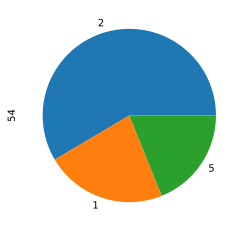

```python
##### Author : Amir Shokri
##### github link : https://github.com/amirshnll/Covertype
##### dataset link : http://archive.ics.uci.edu/ml/datasets/Covertype
##### email : amirsh.nll@gmail.com
```


```python
import pandas as pd
from sklearn.preprocessing import MinMaxScaler
from sklearn.decomposition import PCA
from sklearn.model_selection import train_test_split
from sklearn.metrics import mean_squared_error as MSE
from sklearn.metrics import classification_report
```


```python
df = pd.read_csv('covtype_data.csv', header=None)
```


```python
df
```


<div>
<style scoped>
    .dataframe tbody tr th:only-of-type {
        vertical-align: middle;
    }

    .dataframe tbody tr th {
        vertical-align: top;
    }

    .dataframe thead th {
        text-align: right;
    }
</style>
<table border="1" class="dataframe">
  <thead>
    <tr style="text-align: right;">
      <th></th>
      <th>0</th>
      <th>1</th>
      <th>2</th>
      <th>3</th>
      <th>4</th>
      <th>5</th>
      <th>6</th>
      <th>7</th>
      <th>8</th>
      <th>9</th>
      <th>...</th>
      <th>45</th>
      <th>46</th>
      <th>47</th>
      <th>48</th>
      <th>49</th>
      <th>50</th>
      <th>51</th>
      <th>52</th>
      <th>53</th>
      <th>54</th>
    </tr>
  </thead>
  <tbody>
    <tr>
      <th>0</th>
      <td>2596</td>
      <td>51</td>
      <td>3</td>
      <td>258</td>
      <td>0</td>
      <td>510</td>
      <td>221</td>
      <td>232</td>
      <td>148</td>
      <td>6279</td>
      <td>...</td>
      <td>0</td>
      <td>0</td>
      <td>0</td>
      <td>0</td>
      <td>0</td>
      <td>0</td>
      <td>0</td>
      <td>0</td>
      <td>0</td>
      <td>5</td>
    </tr>
    <tr>
      <th>1</th>
      <td>2590</td>
      <td>56</td>
      <td>2</td>
      <td>212</td>
      <td>-6</td>
      <td>390</td>
      <td>220</td>
      <td>235</td>
      <td>151</td>
      <td>6225</td>
      <td>...</td>
      <td>0</td>
      <td>0</td>
      <td>0</td>
      <td>0</td>
      <td>0</td>
      <td>0</td>
      <td>0</td>
      <td>0</td>
      <td>0</td>
      <td>5</td>
    </tr>
    <tr>
      <th>2</th>
      <td>2804</td>
      <td>139</td>
      <td>9</td>
      <td>268</td>
      <td>65</td>
      <td>3180</td>
      <td>234</td>
      <td>238</td>
      <td>135</td>
      <td>6121</td>
      <td>...</td>
      <td>0</td>
      <td>0</td>
      <td>0</td>
      <td>0</td>
      <td>0</td>
      <td>0</td>
      <td>0</td>
      <td>0</td>
      <td>0</td>
      <td>2</td>
    </tr>
    <tr>
      <th>3</th>
      <td>2785</td>
      <td>155</td>
      <td>18</td>
      <td>242</td>
      <td>118</td>
      <td>3090</td>
      <td>238</td>
      <td>238</td>
      <td>122</td>
      <td>6211</td>
      <td>...</td>
      <td>0</td>
      <td>0</td>
      <td>0</td>
      <td>0</td>
      <td>0</td>
      <td>0</td>
      <td>0</td>
      <td>0</td>
      <td>0</td>
      <td>2</td>
    </tr>
    <tr>
      <th>4</th>
      <td>2595</td>
      <td>45</td>
      <td>2</td>
      <td>153</td>
      <td>-1</td>
      <td>391</td>
      <td>220</td>
      <td>234</td>
      <td>150</td>
      <td>6172</td>
      <td>...</td>
      <td>0</td>
      <td>0</td>
      <td>0</td>
      <td>0</td>
      <td>0</td>
      <td>0</td>
      <td>0</td>
      <td>0</td>
      <td>0</td>
      <td>5</td>
    </tr>
    <tr>
      <th>...</th>
      <td>...</td>
      <td>...</td>
      <td>...</td>
      <td>...</td>
      <td>...</td>
      <td>...</td>
      <td>...</td>
      <td>...</td>
      <td>...</td>
      <td>...</td>
      <td>...</td>
      <td>...</td>
      <td>...</td>
      <td>...</td>
      <td>...</td>
      <td>...</td>
      <td>...</td>
      <td>...</td>
      <td>...</td>
      <td>...</td>
      <td>...</td>
    </tr>
    <tr>
      <th>581007</th>
      <td>2396</td>
      <td>153</td>
      <td>20</td>
      <td>85</td>
      <td>17</td>
      <td>108</td>
      <td>240</td>
      <td>237</td>
      <td>118</td>
      <td>837</td>
      <td>...</td>
      <td>0</td>
      <td>0</td>
      <td>0</td>
      <td>0</td>
      <td>0</td>
      <td>0</td>
      <td>0</td>
      <td>0</td>
      <td>0</td>
      <td>3</td>
    </tr>
    <tr>
      <th>581008</th>
      <td>2391</td>
      <td>152</td>
      <td>19</td>
      <td>67</td>
      <td>12</td>
      <td>95</td>
      <td>240</td>
      <td>237</td>
      <td>119</td>
      <td>845</td>
      <td>...</td>
      <td>0</td>
      <td>0</td>
      <td>0</td>
      <td>0</td>
      <td>0</td>
      <td>0</td>
      <td>0</td>
      <td>0</td>
      <td>0</td>
      <td>3</td>
    </tr>
    <tr>
      <th>581009</th>
      <td>2386</td>
      <td>159</td>
      <td>17</td>
      <td>60</td>
      <td>7</td>
      <td>90</td>
      <td>236</td>
      <td>241</td>
      <td>130</td>
      <td>854</td>
      <td>...</td>
      <td>0</td>
      <td>0</td>
      <td>0</td>
      <td>0</td>
      <td>0</td>
      <td>0</td>
      <td>0</td>
      <td>0</td>
      <td>0</td>
      <td>3</td>
    </tr>
    <tr>
      <th>581010</th>
      <td>2384</td>
      <td>170</td>
      <td>15</td>
      <td>60</td>
      <td>5</td>
      <td>90</td>
      <td>230</td>
      <td>245</td>
      <td>143</td>
      <td>864</td>
      <td>...</td>
      <td>0</td>
      <td>0</td>
      <td>0</td>
      <td>0</td>
      <td>0</td>
      <td>0</td>
      <td>0</td>
      <td>0</td>
      <td>0</td>
      <td>3</td>
    </tr>
    <tr>
      <th>581011</th>
      <td>2383</td>
      <td>165</td>
      <td>13</td>
      <td>60</td>
      <td>4</td>
      <td>67</td>
      <td>231</td>
      <td>244</td>
      <td>141</td>
      <td>875</td>
      <td>...</td>
      <td>0</td>
      <td>0</td>
      <td>0</td>
      <td>0</td>
      <td>0</td>
      <td>0</td>
      <td>0</td>
      <td>0</td>
      <td>0</td>
      <td>3</td>
    </tr>
  </tbody>
</table>
<p>581012 rows × 55 columns</p>
</div>


```python
df.describe()
```


<div>
<style scoped>
    .dataframe tbody tr th:only-of-type {
        vertical-align: middle;
    }

    .dataframe tbody tr th {
        vertical-align: top;
    }

    .dataframe thead th {
        text-align: right;
    }
</style>
<table border="1" class="dataframe">
  <thead>
    <tr style="text-align: right;">
      <th></th>
      <th>0</th>
      <th>1</th>
      <th>2</th>
      <th>3</th>
      <th>4</th>
      <th>5</th>
      <th>6</th>
      <th>7</th>
      <th>8</th>
      <th>9</th>
      <th>...</th>
      <th>45</th>
      <th>46</th>
      <th>47</th>
      <th>48</th>
      <th>49</th>
      <th>50</th>
      <th>51</th>
      <th>52</th>
      <th>53</th>
      <th>54</th>
    </tr>
  </thead>
  <tbody>
    <tr>
      <th>count</th>
      <td>581012.000000</td>
      <td>581012.000000</td>
      <td>581012.000000</td>
      <td>581012.000000</td>
      <td>581012.000000</td>
      <td>581012.000000</td>
      <td>581012.000000</td>
      <td>581012.000000</td>
      <td>581012.000000</td>
      <td>581012.000000</td>
      <td>...</td>
      <td>581012.000000</td>
      <td>581012.000000</td>
      <td>581012.000000</td>
      <td>581012.000000</td>
      <td>581012.000000</td>
      <td>581012.000000</td>
      <td>581012.000000</td>
      <td>581012.000000</td>
      <td>581012.000000</td>
      <td>581012.000000</td>
    </tr>
    <tr>
      <th>mean</th>
      <td>2959.365301</td>
      <td>155.656807</td>
      <td>14.103704</td>
      <td>269.428217</td>
      <td>46.418855</td>
      <td>2350.146611</td>
      <td>212.146049</td>
      <td>223.318716</td>
      <td>142.528263</td>
      <td>1980.291226</td>
      <td>...</td>
      <td>0.090392</td>
      <td>0.077716</td>
      <td>0.002773</td>
      <td>0.003255</td>
      <td>0.000205</td>
      <td>0.000513</td>
      <td>0.026803</td>
      <td>0.023762</td>
      <td>0.015060</td>
      <td>2.051471</td>
    </tr>
    <tr>
      <th>std</th>
      <td>279.984734</td>
      <td>111.913721</td>
      <td>7.488242</td>
      <td>212.549356</td>
      <td>58.295232</td>
      <td>1559.254870</td>
      <td>26.769889</td>
      <td>19.768697</td>
      <td>38.274529</td>
      <td>1324.195210</td>
      <td>...</td>
      <td>0.286743</td>
      <td>0.267725</td>
      <td>0.052584</td>
      <td>0.056957</td>
      <td>0.014310</td>
      <td>0.022641</td>
      <td>0.161508</td>
      <td>0.152307</td>
      <td>0.121791</td>
      <td>1.396504</td>
    </tr>
    <tr>
      <th>min</th>
      <td>1859.000000</td>
      <td>0.000000</td>
      <td>0.000000</td>
      <td>0.000000</td>
      <td>-173.000000</td>
      <td>0.000000</td>
      <td>0.000000</td>
      <td>0.000000</td>
      <td>0.000000</td>
      <td>0.000000</td>
      <td>...</td>
      <td>0.000000</td>
      <td>0.000000</td>
      <td>0.000000</td>
      <td>0.000000</td>
      <td>0.000000</td>
      <td>0.000000</td>
      <td>0.000000</td>
      <td>0.000000</td>
      <td>0.000000</td>
      <td>1.000000</td>
    </tr>
    <tr>
      <th>25%</th>
      <td>2809.000000</td>
      <td>58.000000</td>
      <td>9.000000</td>
      <td>108.000000</td>
      <td>7.000000</td>
      <td>1106.000000</td>
      <td>198.000000</td>
      <td>213.000000</td>
      <td>119.000000</td>
      <td>1024.000000</td>
      <td>...</td>
      <td>0.000000</td>
      <td>0.000000</td>
      <td>0.000000</td>
      <td>0.000000</td>
      <td>0.000000</td>
      <td>0.000000</td>
      <td>0.000000</td>
      <td>0.000000</td>
      <td>0.000000</td>
      <td>1.000000</td>
    </tr>
    <tr>
      <th>50%</th>
      <td>2996.000000</td>
      <td>127.000000</td>
      <td>13.000000</td>
      <td>218.000000</td>
      <td>30.000000</td>
      <td>1997.000000</td>
      <td>218.000000</td>
      <td>226.000000</td>
      <td>143.000000</td>
      <td>1710.000000</td>
      <td>...</td>
      <td>0.000000</td>
      <td>0.000000</td>
      <td>0.000000</td>
      <td>0.000000</td>
      <td>0.000000</td>
      <td>0.000000</td>
      <td>0.000000</td>
      <td>0.000000</td>
      <td>0.000000</td>
      <td>2.000000</td>
    </tr>
    <tr>
      <th>75%</th>
      <td>3163.000000</td>
      <td>260.000000</td>
      <td>18.000000</td>
      <td>384.000000</td>
      <td>69.000000</td>
      <td>3328.000000</td>
      <td>231.000000</td>
      <td>237.000000</td>
      <td>168.000000</td>
      <td>2550.000000</td>
      <td>...</td>
      <td>0.000000</td>
      <td>0.000000</td>
      <td>0.000000</td>
      <td>0.000000</td>
      <td>0.000000</td>
      <td>0.000000</td>
      <td>0.000000</td>
      <td>0.000000</td>
      <td>0.000000</td>
      <td>2.000000</td>
    </tr>
    <tr>
      <th>max</th>
      <td>3858.000000</td>
      <td>360.000000</td>
      <td>66.000000</td>
      <td>1397.000000</td>
      <td>601.000000</td>
      <td>7117.000000</td>
      <td>254.000000</td>
      <td>254.000000</td>
      <td>254.000000</td>
      <td>7173.000000</td>
      <td>...</td>
      <td>1.000000</td>
      <td>1.000000</td>
      <td>1.000000</td>
      <td>1.000000</td>
      <td>1.000000</td>
      <td>1.000000</td>
      <td>1.000000</td>
      <td>1.000000</td>
      <td>1.000000</td>
      <td>7.000000</td>
    </tr>
  </tbody>
</table>
<p>8 rows × 55 columns</p>
</div>


```python
x = df[df.columns[:54]]
y = df[df.columns[54]]
scaler = MinMaxScaler()
scaled_x = scaler.fit_transform(x)

```


```python
y.value_counts().plot.pie()

```


    <matplotlib.axes._subplots.AxesSubplot at 0x1c9c8d1c488>





```python
#Dimentionality reduction
pca = PCA(n_components=15)
reduced_x = pca.fit_transform(scaled_x)
```


```python
#Choose whether reduces or not
X = scaled_x
X = reduced_x
```


```python
X_train, X_test, y_train, y_test = train_test_split(X, y, test_size=0.3, random_state=0)
```


```python
#Now we run algorithms and evaluate

```


```python
from sklearn.naive_bayes import CategoricalNB
cnb = CategoricalNB()
cnb.fit(X_train, y_train)
predicted = cnb.predict(X_test)

print('MSE:', MSE(y_test, predicted))
print(classification_report(y_test, predicted))
```

    MSE: 1.8519196346612814
                  precision    recall  f1-score   support
    
               1       0.67      0.03      0.06     63498
               2       0.51      0.98      0.67     85198
               3       0.58      0.33      0.42     10581
               4       0.00      0.00      0.00       822
               5       0.00      0.00      0.00      2850
               6       0.00      0.00      0.00      5229
               7       0.00      0.00      0.00      6126
    
        accuracy                           0.51    174304
       macro avg       0.25      0.19      0.16    174304
    weighted avg       0.52      0.51      0.37    174304
    
    


```python
from sklearn.neural_network import MLPClassifier
mlp = MLPClassifier(hidden_layer_sizes=(100, 100), activation='relu', solver='adam', alpha=0.0001)
mlp.fit(X_train, y_train)
predicted = mlp.predict(X_test)

print('MSE:', MSE(y_test, predicted))
print(classification_report(y_test, predicted))
```

    MSE: 0.96
                  precision    recall  f1-score   support
    
               1       0.66      0.58      0.62        71
               2       0.81      0.82      0.81       168
               5       0.78      0.87      0.82        61
    
        accuracy                           0.77       300
       macro avg       0.75      0.75      0.75       300
    weighted avg       0.77      0.77      0.77       300
    
    


```python
from sklearn.neighbors import KNeighborsClassifier
knn = KNeighborsClassifier(n_neighbors=5)
knn.fit(X_train, y_train)
predicted = knn.predict(X_test)

print('MSE:', MSE(y_test, predicted))
print(classification_report(y_test, predicted))
```

    MSE: 0.35506930420414906
                  precision    recall  f1-score   support
    
               1       0.93      0.92      0.93     63498
               2       0.94      0.95      0.94     85198
               3       0.92      0.93      0.92     10581
               4       0.86      0.71      0.78       822
               5       0.84      0.77      0.80      2850
               6       0.87      0.86      0.87      5229
               7       0.94      0.93      0.93      6126
    
        accuracy                           0.93    174304
       macro avg       0.90      0.87      0.88    174304
    weighted avg       0.93      0.93      0.93    174304
    
    


```python
from sklearn.tree import DecisionTreeClassifier
Dtree = DecisionTreeClassifier()
Dtree.fit(X_train, y_train)
predicted = Dtree.predict(X_test)

print('MSE:', MSE(y_test, predicted))
print(classification_report(y_test, predicted))
```

    MSE: 0.4798799798053975
                  precision    recall  f1-score   support
    
               1       0.90      0.90      0.90     63498
               2       0.91      0.91      0.91     85198
               3       0.88      0.88      0.88     10581
               4       0.74      0.73      0.74       822
               5       0.73      0.74      0.74      2850
               6       0.80      0.80      0.80      5229
               7       0.92      0.92      0.92      6126
    
        accuracy                           0.90    174304
       macro avg       0.84      0.84      0.84    174304
    weighted avg       0.90      0.90      0.90    174304
    
    


```python
from sklearn.linear_model import LogisticRegression
lreg = LogisticRegression()
lreg.fit(X_train, y_train)
predicted = lreg.predict(X_test)

print('MSE:', MSE(y_test, predicted))
print(classification_report(y_test, predicted))
```

    MSE: 1.7821335138608407
                  precision    recall  f1-score   support
    
               1       0.66      0.57      0.61     63498
               2       0.67      0.80      0.73     85198
               3       0.60      0.76      0.67     10581
               4       0.11      0.00      0.00       822
               5       1.00      0.00      0.00      2850
               6       0.37      0.10      0.15      5229
               7       0.66      0.37      0.47      6126
    
        accuracy                           0.66    174304
       macro avg       0.58      0.37      0.38    174304
    weighted avg       0.66      0.66      0.64    174304
    
    


```python

```
